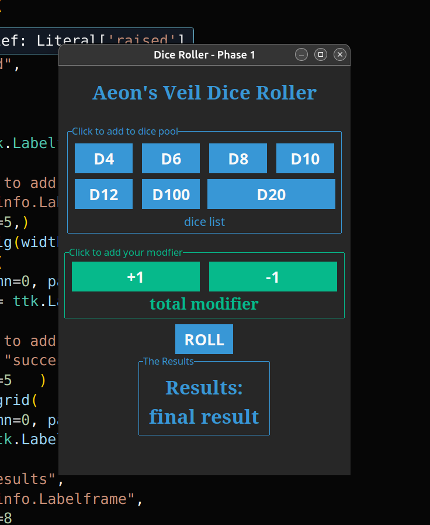

# 🎲 Python Dice Roller for TTRPGs

A simple yet powerful dice roller tool built using Python and `ttkbootstrap`.
Ideal for tabletop role-playing games,this app supports single and multiple
standard dice and includes modifiers and total roll calculation.

## 🛠 Features

- Roll any standard dice (D4, D6, D8, D10, D12, D20, D100)
- Roll multiple dice of any kind at once
- Clean GUI with dark mode using `ttkbootstrap`
- Ready to integrate into Discord or Godot

## 🚀 Preview



## 📦 Installation

1. Clone this repo:
   ```bash
   git clone https://github.com/BarbaarossaLives/DiceRollerTool.git
   cd DiceRollerTool

2. Install dependencies

   pip install ttkstrap

3 Run the tool

   python dice_roller_phase_1.py


COMING SOON
   Discord bot integration
   Character/weapon/armor integration 
